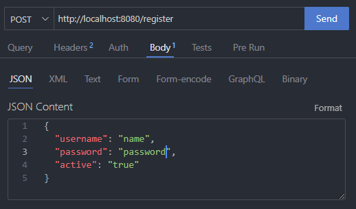

# Streaming-Backend

## Installation

1. Create database named "streaming" in MongoDB
2.

## API

The backend of this streaming project exposes the following API endpoints:

1. `http://localhost:8080/register`  

2. `http://localhost:8080/login`  

3. `http://localhost:8080/video/upload` 

4. `http://localhost:8080/video/get/{id}` 

"# UserService" 
# UserService-NT548
